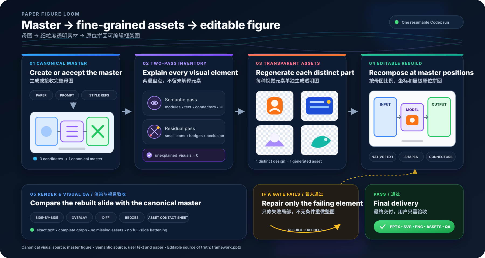

# Paper Figure Loom

**English** | [简体中文](README_CN.md)

**Take a framework figure apart, then weave its pieces back into a PowerPoint you can actually edit.**

Paper Figure Loom turns a handoff that used to bounce between GPT, downloads, and local Codex into one Codex task. It establishes a complete master figure, regenerates every separable UI element, icon, and illustration as its own transparent asset, then recomposes those assets at the master's original scale, position, layer, and color.

Provide a paper or a master image and review the final result. There is no repeated “continue generating,” no manual asset download, and no ZIP handoff to another task.



## The workflow this Skill actually runs

The order is fixed. None of the three phases is optional.

### 1. Establish one complete master figure

If you have already used GPT to DIY a figure from your paper, attach that image. The Skill treats it as the canonical visual source and does not redesign its composition.

If you only have a paper, prompt, or style references, the Skill first locks the exact wording, modules, and connections. It then uses Codex's built-in image generation to make three complete candidates, rejects candidates missing required content, and selects one canonical master.

The master controls composition, palette, and visual style. Explicit user text and paper semantics control the final content, so misspelled text in a generated master cannot overwrite the source.

### 2. Regenerate every fine-grained UI and icon as a transparent asset

This is the automated form of the original instruction:

> Find, as completely and at as fine a granularity as possible, every UI element, icon, and illustration that can stand on its own. Regenerate each one as a separate image with no background.

The Skill inspects the master twice. The first pass finds modules, text, connectors, and obvious visual components. The second looks specifically for small icons, decoration, badges, occluded objects, and corner details left unexplained by the first pass.

It follows concrete rules:

- every visually separable UI element, icon, illustration, or decoration gets its own asset job;
- each asset generation uses both the full master and its local crop, and generates only the target object;
- the object is generated on a flat key color and the background is removed; outputs without meaningful transparency or visible foreground fail;
- when one identical icon appears three times, all three placements remain in the scene, while the icon is generated once and reused;
- ordinary text, simple panels, and arrows stay native PowerPoint objects instead of becoming bitmaps; simple icons may be rebuilt as true vector shapes;
- nearby assets are not merged merely to save generation calls.

The default is grounded regeneration, not a crop that keeps the master's background. Direct extraction is allowed only when the user explicitly asks for it.

### 3. Recompose the figure at the master's original positions

The Skill now uses the master as an assembly map. It places every native object and regenerated asset at normalized master coordinates while preserving canvas ratio, object aspect ratios, relative positions, palette, occlusion order, and connector relationships.

Text, panels, and connectors remain selectable PowerPoint objects. Complex UI and illustrations are transparent PNGs with locked aspect ratios. The full master image is never placed behind or over the slide as a fidelity shortcut.

Finally, the Skill renders the PowerPoint and creates side-by-side, overlay, difference, bounding-box, and asset-contact-sheet views. It repairs only failed elements. If the run cannot meet its gates within the repair budget, it returns a blocker report and resumable state instead of calling the result successful.

## How to use it

### A. You already have a GPT-generated master

Attach the master image to a Codex task and send:

```text
Use $rebuild-paper-figures on the attached original framework figure.

First, identify as completely and at as fine a granularity as possible every UI element, icon,
illustration, and decoration that can stand on its own. For each distinct visual element,
regenerate one separate image with no background.

Then use the original framework figure as the only layout master and recompose it as a one-slide,
editable PowerPoint from those fine-grained assets. Preserve the canvas ratio, asset proportions,
relative positions, z-order, connectors, and colors. Keep text, boxes, and connectors natively
editable. Run visual comparison and local repair, then return only the final deliverables.
```

This is `rebuild` mode in the run files. It is the most mature route and the closest match to the original manual workflow.

### B. Start from a paper

Attach the paper and optional style references, then send:

```text
Use $rebuild-paper-figures to create a single-page method figure from the attached paper.

Lock the exact wording, modules, and connections first. Generate three complete master candidates
and select one that contains every required part. Then regenerate every separable UI element,
icon, illustration, and decoration from that master as its own transparent image. Finally,
recompose an editable PowerPoint at the selected master's original proportions, positions,
layers, and colors. Complete visual comparison and local repair without intermediate approval;
ask me only for final acceptance.
```

This is `author` mode. It brings the initial “use GPT to DIY a master from the paper” step into the same task. After a master is selected, it uses exactly the same asset and reconstruction phases as `rebuild`.

### Resume after interruption

Every stage is saved atomically. Resume with the same run directory:

```text
Use $rebuild-paper-figures to continue the run in /absolute/path/to/run-directory.
Read run-state.json, keep every completed stage and accepted asset, and continue from the next action.
```

## Install

Add the repository as a Codex plugin marketplace:

```bash
codex plugin marketplace add Thanx01/paper-figure-loom --ref main
```

Restart Codex Desktop, open **Plugins**, select the **personal** marketplace, and install **Paper Figure Loom**.

For a local clone:

```bash
git clone https://github.com/Thanx01/paper-figure-loom.git
codex plugin marketplace add /absolute/path/to/paper-figure-loom
```

The first release targets local Codex Desktop and uses built-in image generation. It does not require `OPENAI_API_KEY` and does not automate the ChatGPT website.

## What you receive

- `framework.pptx` — the editable source of truth;
- `framework.svg` and `framework.png` — the complete figure;
- `assets/png/` — transparent PNGs for fine-grained visual assets;
- `assets/svg/` — one SVG per asset; complex SVGs honestly embed PNG data rather than pretending to be pure vector;
- `assets-manifest.json` — provenance, strategy, instance mapping, alpha checks, and editability for every asset;
- `qa/` and `qa-report.json` — comparisons, differences, bounding boxes, and the asset contact sheet;
- `paper-figure-loom-delivery.zip` — the complete delivery.

## What “1:1” means

“1:1” means the structure, verbatim text, canvas ratio, element positions, sizes, layers, colors, and natively rebuilt geometry stay within the declared tolerances. It also means no stretched assets, missing icons, or full-slide screenshot disguised as an editable result.

Regenerated artwork does not copy source pixels. For those regions, the guarantee is a close match in role, silhouette, proportions, palette, and visual weight—not pixel identity. QA evaluates regenerated regions separately from native reconstruction.

## Current boundaries

- One single-page figure and one PowerPoint slide per run.
- PowerPoint is the editable source of truth; VSDX is not produced yet.
- The default budget covers 32 distinct complex assets with two attempts each. An over-budget inventory becomes a blocker instead of silently dropping elements.
- Live image generation runs in Codex Desktop. GitHub Actions runs static, unit, and recorded-replay tests only.
- `rebuild` is the release focus. `author` is connected to the full state machine but paper parsing and master selection will continue to be hardened.

## For contributors

<details>
<summary>State machine, CLI, and tests</summary>

The Skill lives at `plugins/paper-figure-loom/skills/rebuild-paper-figures`. Public JSON contracts live in [`contracts/`](contracts/).

Codex normally drives the single `forge.mjs` entry point. For diagnostics, create:

```json
{
  "mode": "rebuild",
  "master_image": "/absolute/path/to/master.png",
  "output_dir": "/absolute/path/to/delivery"
}
```

Then use the Node executable bundled with Codex Desktop:

```bash
<bundled-node> plugins/paper-figure-loom/skills/rebuild-paper-figures/scripts/forge.mjs init \
  --request /absolute/path/to/request.json \
  --run-dir /absolute/path/to/run

<bundled-node> plugins/paper-figure-loom/skills/rebuild-paper-figures/scripts/forge.mjs next \
  --run-dir /absolute/path/to/run
```

Execute each action returned by `next`. Commands are `init`, `next`, `record`, `validate`, `build`, `qa`, and `package`. Do not edit `run-state.json` manually.

Deterministic checks:

```bash
pnpm install --frozen-lockfile
pnpm test
pnpm run validate
```

Public tests use original synthetic masters and recorded assets without live image generation. Release checks also run the official Skill/Plugin validators and build a real PPTX inside Codex Desktop.

</details>

## License

MIT. User-provided papers, master figures, style references, and generated artifacts retain their own provenance and rights.
